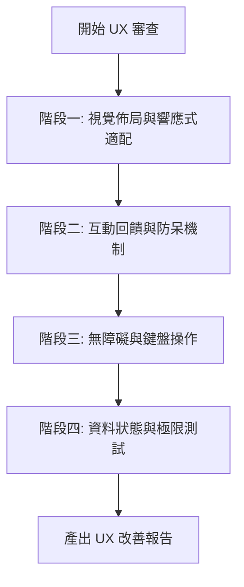

# UX 體驗審查流程 (UX Check Workflow)

本工作流程用於系統性檢驗網頁應用的使用者體驗（UX）、介面設計（UI）與無障礙性（Accessibility），確保功能操作直覺、防呆機制完善且適配多元裝置。

---

## 審查階段與檢核清單



---

### 階段一：視覺佈局與響應式適配 (Layout & Responsive)

* [ ] **多裝置斷點適配**：
  * **桌面端 (≥1200px)**：排版是否充分利用水平寬度，各卡片高度是否協調。
  * **平板端 (768px ~ 1024px)**：表格與網格是否能自適應縮放，避免橫向滾動條破版。
  * **行動端 (<768px)**：導航頁籤（Tabs）是否易於橫滑，按鈕是否自動換行或全寬呈現。
* [ ] **色彩對比與可讀性**：
  * 文字與背景對比度符合 WCAG AA 標準（常規文字至少 4.5:1，大標題至少 3:1）。
  * 狀態顏色語意清晰（綠色代表正常/出席、黃色代表病假/警示、紅色代表曠課/危險）。
* [ ] **字體層級與行距**：
  * 標題、副標、內文與標籤字級層次分明。
  * 多行文字行高（line-height）維持在 1.4 至 1.6 倍，避免閱讀疲倦。

---

### 階段二：互動回饋與防呆機制 (Interaction & Defensive UX)

* [ ] **觸控與點擊熱區**：
  * 重要互動按鈕與選單點擊區域至少達 44 × 44 px，避免誤觸或觸控困難。
  * 滑鼠懸停（Hover）、點擊中（Active）、聚焦（Focus）皆具備明顯的視覺回饋樣式。
* [ ] **防呆與確認對話框**：
  * 高風險操作（如「清空加扣分紀錄」、「還原示範資料」、「刪除學生」）必須具備二次確認對話框。
  * 表單必填欄位具備格式檢查與即時提示，防止送出空白或無效資料（如負數座號）。
* [ ] **空狀態處理 (Empty States)**：
  * 當學生名冊為空、歷史紀錄為空或搜尋無符合結果時，顯示友善的引導說明圖文，而非空白留白。
* [ ] **極限資料測試 (Edge Cases)**：
  * 測試輸入超長學生姓名（例如 10 個字以上）、超長備註，確認元件不會撐開變形或遮擋操作按鈕。

---

### 階段三：無障礙與鍵盤操作 (Accessibility & Navigation)

* [ ] **鍵盤導航可操作性**：
  * 可完全透過 `Tab` 鍵循序聚焦所有可互動元素，焦點框（Focus Outline）清晰可見。
  * 彈出式視窗（Modal）開啟時，支援按 `Esc` 鍵關閉；按下 `Enter` 鍵可快速觸發主要動作。
* [ ] **無障礙輔助標記 (A11y)**：
  * 僅包含 Emoji 或圖示的純圖標按鈕，需加上 `title` 或 `aria-label` 屬性供螢幕報讀軟體識別。
  * 表單輸入框（`<input>`、`<select>`）需與對應的 `<label>` 關聯。

---

### 階段四：狀態持久化與極限測試 (State & Resilience)

* [ ] **本地儲存持久化**：
  * 新增學生、點名或調整積分後，手動強制重新整理頁面（F5 / Cmd+R），驗證資料是否 100% 完整保留。
* [ ] **備份與還原防錯**：
  * 匯出之 JSON 檔案是否可正確匯入還原。
  * 嘗試上傳格式錯誤或非 JSON 檔案時，系統是否能優雅攔截並彈出警示，而不引發 JavaScript 例外崩潰。

---

## 產出審查報告格式 (Report Template)

執行本 Workflow 後，應按照以下格式彙整審查結果：

```markdown
# UX 體驗審查報告

## 綜合評級：[優良 / 良好 / 待改善]

### 🔴 嚴重問題 (Critical)
* [問題說明、復現步驟、修復建議]

### 🟡 次要問題 (Medium)
* [問題說明、復現步驟、修復建議]

### 🟢 細節優化建議 (Polish / Minor)
* [字級微調、視覺間距、微互動動畫等建議]

### 建議後續行動清單 (Action Items)
1. ...
```
